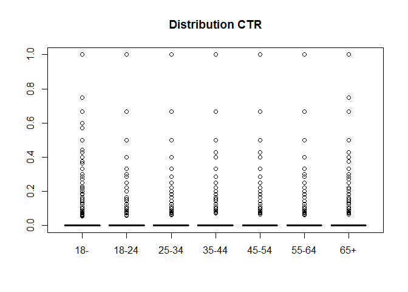
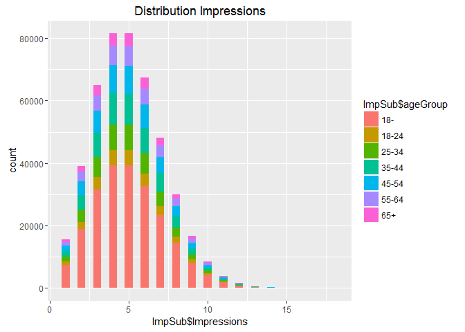
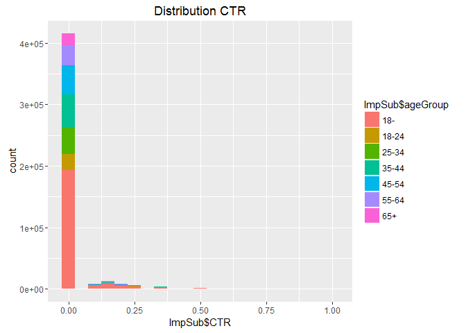
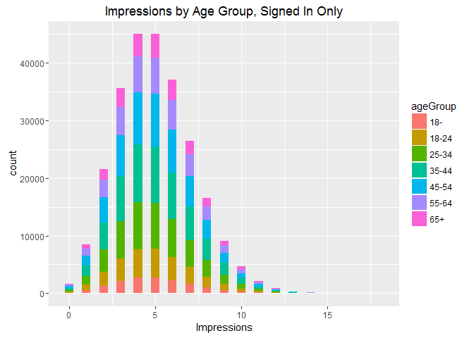
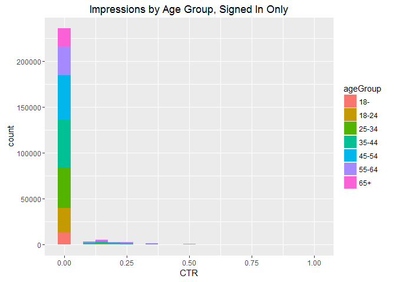

# Post Live Session 8 - May 29th
Mike Martos  
June 25, 2016  


```r
library(downloader)
library(ggplot2)
library(vcd)
```

```
## Loading required package: grid
```

###Download data 

```r
download("http://stat.columbia.edu/~rachel/datasets/nyt29.csv",
         destfile="./Data/Raw/clickstream29.csv")
clickstream29 <- read.csv("./Data/Raw/clickstream29.csv")
```

###Tidy data

```r
#Get min and max of age
min <- min(clickstream29$Age)
max <- max(clickstream29$Age)
#Create breaks
breaks <- c(min,18,24,34,44,54,64,max)
#Make the signed in a factor
clickstream29$Signed_In <- factor(clickstream29$Signed_In)
#Make the Gender in a factor
clickstream29$Gender <- factor(clickstream29$Gender)
#Make the Gender in a factor
clickstream29$CTR <- clickstream29$Clicks/clickstream29$Impressions
```

###Create new field for ageGroup and assign from breaks

```r
clickstream29$ageGroup <- cut(clickstream29$Age, breaks, 
                              labels = c("18-", "18-24", "25-34", "35-44", "45-54", "55-64", "65+"), 
                              include.lowest = TRUE, ordered_result = TRUE)
```

###Create new field for CTRGroup and assign from breaks, intervals closed on the left

```r
#Create breaks
breaks <- c(0,0.2,0.4,0.6,0.8,1)
clickstream29$CTRGroup <- cut(clickstream29$CTR, breaks, 
                              labels = c("0.0-0.2", "0.2-0.4", "0.4-0.6", "0.6-0.8", "0.8-1.0"), 
                              include.lowest = TRUE, ordered_result = TRUE, right = FALSE)
```

###Get the total number of Male, Impressions, Clicks and Signed_In (0=Female, 1=Male)


###Remove some data and store in variables

```r
#Remove records with no ages
clickstream29Age <- subset(clickstream29, clickstream29$Age > 0)
#Subset records with clicks
clickstream29Click <- subset(clickstream29Age, clickstream29Age$Clicks > 0)
#Subset records with Impressions > 0
ImpSub <- subset(clickstream29, clickstream29$Impressions > 0)
```

###Store intermediate files

```r
write.csv(clickstream29, file = "./Data/ClickStream29ageGroup.csv")
write.csv(clickstream29Age, file = "./Data/ClickStream29ageGroupWithAge.csv")
write.csv(clickstream29Click, file = "./Data/ClickStream29ageGroupWithAgeClicks.csv")
write.csv(ImpSub, file = "./Data/ImpSub.csv")
```


###Plot distributions of number impressions and click-through-rate for the age groups, the problem here is that the EDA showed the age, gender are only recorded for Signed_in users, thus the users that were not signed in will have 0 age and will have 0 as gender, which is not correct.

```r
plot(ImpSub$ageGroup, ImpSub$CTR, main="Distribution CTR")
```

<!-- -->

###Number or users registered as Male

```r
sum(ImpSub$Gender == 1)
```

```
## [1] 131325
```

###Summatory of number of impresions

```r
sum(ImpSub$Impressions)
```

```
## [1] 2313441
```

###Summatory of number of clicks

```r
sum(ImpSub$Clicks)
```

```
## [1] 47710
```

###Number of users showing as signed in.

```r
sum(ImpSub$Signed_In == 1)
```

```
## [1] 252994
```

###Mean of Age

```r
mean(ImpSub$Age)
```

```
## [1] 23.15368
```

###Mean of Impressions

```r
mean(ImpSub$Impressions)
```

```
## [1] 5.032031
```

###Mean of clicks

```r
mean(ImpSub$Clicks)
```

```
## [1] 0.1037754
```

###Mean of CTR

```r
mean(ImpSub$CTR)
```

```
## [1] 0.020602
```

###Mean of Percentage of males

```r
100 * sum(ImpSub$Gender == 1)/length(ImpSub$Gender)
```

```
## [1] 28.56487
```

###Mean of Percentage of Signed In

```r
100 * sum(ImpSub$Signed_In == 1)/length(ImpSub$Gender)
```

```
## [1] 55.02944
```

###Mean of Impressions by AgeGroup

```r
aggregate(ImpSub[, 3], list(ImpSub$ageGroup), mean)
```

```
##   Group.1        x
## 1     18- 5.035626
## 2   18-24 5.035489
## 3   25-34 5.014613
## 4   35-44 5.031960
## 5   45-54 5.017287
## 6   55-64 5.047573
## 7     65+ 5.036310
```

###Mean of clicks by AgeGroup

```r
aggregate(ImpSub[, 4], list(ImpSub$ageGroup), mean)
```

```
##   Group.1          x
## 1     18- 0.14295815
## 2   18-24 0.04930054
## 3   25-34 0.04949926
## 4   35-44 0.05109620
## 5   45-54 0.04979106
## 6   55-64 0.09875736
## 7     65+ 0.15315631
```

###Mean of CTR by AgeGroup

```r
aggregate(ImpSub[, 6], list(ImpSub$ageGroup), mean)
```

```
##   Group.1           x
## 1     18- 0.028395993
## 2   18-24 0.009613089
## 3   25-34 0.009755117
## 4   35-44 0.010051133
## 5   45-54 0.009998228
## 6   55-64 0.019431290
## 7     65+ 0.030855817
```

###Percentage of Males by AgeGroup

```r
sumAge <- aggregate(ImpSub$Gender == 1,list(ImpSub$ageGroup), sum)
lenAge <- aggregate(ImpSub[, 6], list(ImpSub$ageGroup), length)
merged <- merge(sumAge,lenAge,by="Group.1")
names(merged) <- c("ageGroup","MalesQty","TotalQty")
merged$pct <- round(100 * merged$MalesQty/merged$TotalQty,2)
merged
```

```
##   ageGroup MalesQty TotalQty   pct
## 1      18-     9844   222058  4.43
## 2    18-24    14729    28093 52.43
## 3    25-34    23952    45233 52.95
## 4    35-44    29301    55601 52.70
## 5    45-54    26796    50732 52.82
## 6    55-64    18540    35167 52.72
## 7      65+     8163    22859 35.71
```

###Percentage of signed in by AgeGroup, again, only signed in, show gender, that is why we get these results

```r
meanSigned <- aggregate(ImpSub$Signed_In == 1,list(ImpSub$ageGroup), sum)
lenAge <- aggregate(ImpSub[, 6], list(ImpSub$ageGroup), length)
merged <- merge(meanSigned,lenAge,by="Group.1")
names(merged) <- c("ageGroup","SignedQty","TotalQty")
merged$pct <- round(100 * merged$SignedQty/merged$TotalQty,2)
merged
```

```
##   ageGroup SignedQty TotalQty    pct
## 1      18-     15309   222058   6.89
## 2    18-24     28093    28093 100.00
## 3    25-34     45233    45233 100.00
## 4    35-44     55601    55601 100.00
## 5    45-54     50732    50732 100.00
## 6    55-64     35167    35167 100.00
## 7      65+     22859    22859 100.00
```

###Create a table of the CTRGroup vs AgeGroup counts

```r
table(ImpSub$CTRGroup, ImpSub$ageGroup)
```

```
##          
##              18-  18-24  25-34  35-44  45-54  55-64    65+
##   0.0-0.2 207163  27492  44213  54311  49541  33608  21194
##   0.2-0.4  12911    536    929   1185   1070   1376   1433
##   0.4-0.6   1620     57     74     86    102    154    197
##   0.6-0.8    116      1      1      2      3      5     12
##   0.8-1.0    248      7     16     17     16     24     23
```

###Plot distribution Impressions

```r
qplot(ImpSub$Impressions, main="Distribution Impressions", fill=ImpSub$ageGroup,binwidth = 0.5)
```

<!-- -->

###Plot distribution CTR

```r
qplot(ImpSub$CTR, main="Distribution CTR", fill=ImpSub$ageGroup,binwidth = 0.05)
```

<!-- -->

###As mentioned earlier, I found that only signed in users have real gender and age information recorded, the default age for that group of not signed user is 0, which shows in the previous two plots, give this I've decided to plot the last two graphics for only signed in users, for that I have Data.frame *clickstream29Age* which I calculated earlier in the process. **Note the change in the 18- group**

```r
qplot(Impressions, data=clickstream29Age, fill=ageGroup, 
      main="Impressions by Age Group, Signed In Only",binwidth = 0.5)
```

<!-- -->

```r
qplot(CTR, data=clickstream29Age, fill=ageGroup, 
      main="Impressions by Age Group, Signed In Only",binwidth = 0.05)
```

```
## Warning: Removed 1678 rows containing non-finite values (stat_bin).
```

<!-- -->


       
