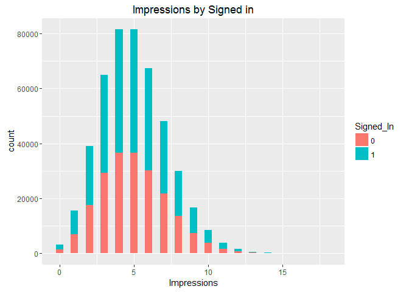

# Post Live Session 8 - May 29th
Mike Martos  
June 25, 2016  


```r
library(downloader)
library(ggplot2)
library(vcd)
```

```
## Loading required package: grid
```

##Download data 

```r
download("http://stat.columbia.edu/~rachel/datasets/nyt29.csv",
         destfile="./Data/Raw/clickstream29.csv")
clickstream29 <- read.csv("./Data/Raw/clickstream29.csv")
```
##Tidy data

```r
#Get min and max of age
min <- min(clickstream29$Age)
max <- max(clickstream29$Age)
#Create breaks
breaks <- c(min,18,24,34,44,54,64,max)
#Create new field for AgeGroup and assign from breaks
clickstream29$AgeGroup <- cut(clickstream29$Age, breaks, 
                              labels = c("18-", "18-24", "25-34", "35-44", "45-54", "55-64", "65+"), 
                              include.lowest = TRUE, ordered_result = TRUE)
#Make the signed in a factor
clickstream29$Signed_In <- factor(clickstream29$Signed_In)
#Make the Gender in a factor
clickstream29$Gender <- factor(clickstream29$Gender)
#Remove records with no ages
clickstream29Age <- subset(clickstream29, clickstream29$Age > 0)
#Subset records with clicks
clickstream29Click <- subset(clickstream29Age, clickstream29Age$Clicks > 0)
```
##Store intermediate files

```r
write.csv(clickstream29, file = "./Data/ClickStream29AgeGroup.csv")
write.csv(clickstream29Age, file = "./Data/ClickStream29AgeGroupWithAge.csv")
write.csv(clickstream29Click, file = "./Data/ClickStream29AgeGroupWithAgeClicks.csv")
```

## Including Plots


##Try to learn about the data

```r
#Show demographics of signed in users
mosaic(~ AgeGroup + Gender, data = clickstream29Age, shade = TRUE, main="Demographics")
```

<!-- -->

```r
#Distribution ages by Gender
qplot(AgeGroup, data=clickstream29Age, fill=Gender, main="Distribution ages by Gender")
```

<!-- -->

```r
#Distribution Impressions by Signed in
qplot(Impressions, data=clickstream29, fill=Signed_In, main="Impressions by Signed in",binwidth = 0.5)
```

<!-- -->

##Answer project questions

```r
#With 0 Clicks
plot(clickstream29Age$AgeGroup, clickstream29Age$Impressions, main="Distribution Impressions")
```

<!-- -->

```r
plot(clickstream29Age$AgeGroup, clickstream29Age$Clicks/clickstream29Age$Impressions, main="Distribution CTR")
```

<!-- -->

```r
#Removing 0 clicks
plot(clickstream29Click$AgeGroup, clickstream29Click$Impressions, main="Distribution Impressions, With a click at least")
```

<!-- -->

```r
plot(clickstream29Click$AgeGroup, clickstream29Click$Clicks/clickstream29Click$Impressions, 
     main="Distribution CTR, With a click at least")
```

<!-- -->

```r
#CTR Exploratory Data
qplot(Clicks/Impressions, data=clickstream29Click, fill=AgeGroup, 
      main="Click-Through-Rate by Age Group, Signed In Only",binwidth = 0.01)
```

<!-- -->

```r
qplot(Clicks/Impressions, data=clickstream29Click, fill=Gender, 
      main="Click-Through-Rate by Gender, Signed In Only",binwidth = 0.01)
```

<!-- -->

##Look at the data from other angles

```r
#Impressions Exploratory Data
qplot(Impressions, data=clickstream29, fill=AgeGroup, 
      main="Impressions by Age Group",binwidth = 0.5)
```

<!-- -->

```r
qplot(Impressions, data=clickstream29Age, fill=AgeGroup, 
      main="Impressions by Age Group, Signed In Only",binwidth = 0.5)
```

<!-- -->

```r
qplot(Impressions, data=clickstream29Age, fill=Gender, 
      main="Impressions by Age Group, Signed In Only",binwidth = 0.5)
```

<!-- -->


       
